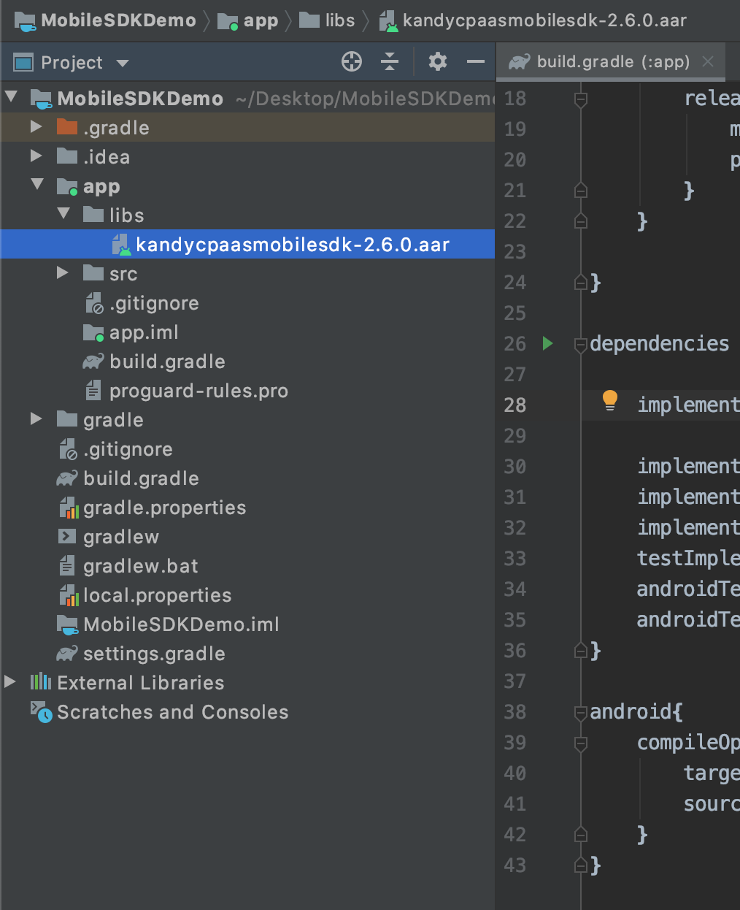
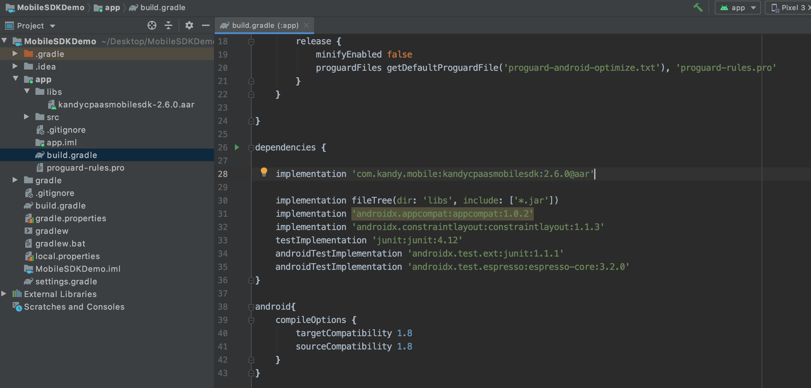

---
  topics:
  - title: Creating the Android project
    body: In this section you will learn how to create the Android project using Android Studio.
  - title: Using the $KANDY$ Mobile SDK in the Android project
    body: In this section you will learn how to use the $KANDY$ Mobile SDK in the Android project.
---
# Get Started

This section provides an example of creating your Android project and using the $KANDY$ Mobile SDK in your project. Android Studio 3.5.2 is used for this example, but you may use your development environment of choice to create your project.

## Creating the Android project

The following procedure uses Android Studio IDE to illustrate adding the Mobile SDK library file to the Android application's build path.

1. Open the development environment (in this example, Android Studio).

2. Click **Start a new Android Studio project**.


<br>

3. Type your **Application name**, **Company domain**, and **Project location** and click **Next**.


<br>

4. Select minimum Android SDK version for phone and tablet (API Level 16 is recommended).

Note that, this is the minimum Android SDK API version that the demo application supports.

For the target SDK version, Google suggests to set API Level 26 or higher. Target SDK can be changed on **build.gradle** file after the project creation.


<br>

5. Select an activity or leave as default (Empty Activity) and click **Next**.


<br>

6. Edit the activity or leave as default and click **Finish**.


### Adding MobileSDK dependency to your project

There are 2 option to add MobileSDK dependency to your project. You can add MobileSDK dependency from github repository or you can add it your project manually. This document will explain both options in detail.

#### Adding the dependency from GitHub repository

1. Add MobileSDK repository url to your root level **build.gradle** file.

```
allprojects {
  repositories {
    google()
    jcenter()

    maven {
      url "https://raw.githubusercontent.com/Kandy-IO/kandy-cpaas-android-sdk/master/dist/"
    }
  }
}
```



2. Add dependcy of MobileSDK to your app level **build.gradle** file.

```
implementation 'com.kandy.mobile:kandycpaasmobilesdk:{$SDK_VERSION$}'
```


<div style="border-style:solid; page-break-inside: avoid;">
<h5>NOTE</h5>
Check latest version of MobileSDK from <a href="https://github.com/Kandy-IO/kandy-cpaas-android-sdk">GitHub</a>.
</div>
<br>

#### Adding the dependency manually

1. Download latest MobileSDK version from [GitHub](https://github.com/Kandy-IO/kandy-cpaas-android-sdk/tree/$SDK_VERSION$/dist/com/kandy/mobile/kandycpaasmobilesdk/$SDK_VERSION$) and copy **aar** file to your project **lib** folder.



2. After that you need to inform gradle that your app will use manual aar files. To do that add **flatDir** path to your root level **build.gradle** file as in the example above.

```
flatDir {
  dirs 'libs'
}
```


3. Add dependcy of MobileSDK to your app level **build.gradle** file with **@aar** prefix.

```
implementation 'com.kandy.mobile:kandycpaasmobilesdk:{$SDK_VERSION$}@aar'
```


### Adding Java 8 support
An Android application project must be compatible with Java 8 when it is using Mobile SDK library. This necessity comes from the WebRTC library, its code is dependent on some Java 8 features. In order to set this compliance, open **build.gradle** file, located under **app** module of **MobileSDKDemoApp** project. Add the configuration script below to the file.

```
android{
  compileOptions {
    targetCompatibility 1.8
    sourceCompatibility 1.8
  }
}
```


## Using the $KANDY$ Mobile SDK in the Android project

Once the library is attached to the Android project, the $KANDY$ Mobile SDK can be used by defining the necessary import items.
The following is an example using the $KANDY$ Mobile SDK in Android:

1. Locate and open **AndroidManifest.xml**.


2. Add the following permissions to the manifest file:

```xml
<uses-feature android:glEsVersion="0x00020000" android:required="true" />
<uses-feature android:name="android.hardware.camera" />
<uses-feature android:name="android.hardware.camera.autofocus" />

<uses-permission android:name="android.permission.INTERNET" />
<uses-permission android:name="android.permission.ACCESS_NETWORK_STATE" />
<uses-permission android:name="android.permission.MODIFY_AUDIO_SETTINGS" />
<uses-permission android:name="android.permission.RECORD_AUDIO" />
<uses-permission android:name="android.permission.CAMERA" />
```

<br>

3. In your project folder, navigate to **res** > **layout** and open **activity_main.xml** to create your UI.


<br>

4. You can create your UI in a graphical mode (if available) or in xml editor mode. In this example, editing will be done in the xml view.

5. Choose a layout for your UI. In Android, developers can use a variety of layouts for UI. In this example, we will use LinearLayout (Vertical) for the UI and set the orientation vertical. The example layout below also contains two buttons and two video views in the LinearLayout.

```xml
<?xml version="1.0" encoding="utf-8"?>

<LinearLayout xmlns:android="http://schemas.android.com/apk/res/android"
    xmlns:app="http://schemas.android.com/apk/res-auto"
    xmlns:tools="http://schemas.android.com/tools"
    android:layout_width="match_parent"
    android:layout_height="match_parent"
    android:gravity="center_horizontal"
    android:orientation="vertical"
    tools:context=".MainActivity">

    <EditText
        android:id="@+id/username"
        android:layout_width="match_parent"
        android:layout_height="wrap_content"
        android:hint="Username"
        android:maxLines="1"
        android:singleLine="true" />

    <EditText
        android:id="@+id/password"
        android:layout_width="match_parent"
        android:layout_height="wrap_content"
        android:hint="Password"
        android:maxLines="1"
        android:singleLine="true" />

    <Button
        android:id="@+id/login_button"
        android:layout_width="match_parent"
        android:layout_height="wrap_content"
        android:text="Login" />

</LinearLayout>
```


<br>
6. Create a custom application class, which extends the generic "Application" structure of Android. Application should set its application context to Mobile SDK when it is created.

*Java Code:*
```java
package com.rbbn.mobilesdkdemo;

import android.app.Application;
import android.content.Context;
import com.rbbn.cpaas.mobile.utilities.Globals;

public class DemoApplication extends Application {

    public void onCreate() {
        super.onCreate();

        Context context = getApplicationContext();
        Globals.setApplicationContext(context);
    }
}
```

*Kotlin Code:*
```kotlin
package com.rbbn.mobilesdkdemo;

import android.app.Application
import com.rbbn.cpaas.mobile.utilities.Globals

class DemoApplication : Application() {

    override fun onCreate() {
        super.onCreate()
        Globals.setApplicationContext(applicationContext)
    }
}
```

<br>
7. Open the MainActivity. If project has no activity, create one.

*Java Code:*
```java
package com.rbbn.mobilesdkdemo;

import android.app.Activity;
import android.os.Bundle;

public class MainActivity extends Activity {

    @Override
    protected void onCreate(Bundle savedInstanceState) {
        super.onCreate(savedInstanceState);
        setContentView(R.layout.activity_main);
    }
}
```

*Kotlin Code:*
```kotlin
package com.rbbn.mobilesdkdemo;

import android.os.Bundle
import androidx.appcompat.app.AppCompatActivity

class MainActivity : AppCompatActivity() {

    override fun onCreate(savedInstanceState: Bundle?) {
        super.onCreate(savedInstanceState)
        setContentView(R.layout.activity_main)
    }
}
```

<br>
8. Set $KANDY$ configurations for connection.

*Java Code:*
```java
Configuration.getInstance().setUseSecureConnection(true);
Configuration.getInstance().setRestServerUrl("$KANDYFQDN$");
Configuration.getInstance().setRestServerPort(443);
}
```
*Kotlin Code:*
```kotlin
Configuration.getInstance().isUseSecureConnection = true
Configuration.getInstance().restServerUrl = "$KANDYFQDN$"
Configuration.getInstance().restServerPort = 443
}
```

<br>
9. Add the following code to gets *"Access And Id Token"* from $KANDY$. Getting access and id token is explained in 

[**Getting Access and Id Token from $KANDY$**](GetStarted.md#getting-access-and-id-token-from-$KANDY$)
section in detail.

*Java Code:*
```java
Button getTokenButton=findViewById(R.id.getTokenButton);
getTokenButton.setOnClickListener(new View.OnClickListener() {
       @Override
      public void onClick(View v) {
        EditText usernameField = findViewById(R.id.username);
        String username = usernameField.getText().toString();
        EditText passwordField = findViewById(R.id.password);
        String password = passwordField.getText().toString();
        HashMap<String,String> requestMap=new HashMap<>();
        requestMap.put("username",username);
        requestMap.put("password",password);
        requestMap.put("client_id","your_client_id");
        requestMap.put("grant_type","password");
        requestMap.put("scope","openid");
        requestMap.put("client_secret","");
        new AccessAndIdTokenTask().execute(requestMap);
       }
 });
```

*Kotlin Code:*
```kotlin
getToken_button?.setOnClickListener {
    val username = username.text.toString()
    val password = password.text.toString()
    val requestMap: HashMap<String,String> = HashMap()
    requestMap["username"] = username
    requestMap["password"] = password
    requestMap["client_id"] = "your_client_id"
    requestMap["grant_type"] = "password"
    requestMap["scope"] = "openid"
    requestMap["client_secret"] = ""
    AccessandIdTokenTask().execute(requestMap)

}
```

<br>
10. Add the following code to login action for establishing connection to $KANDY$.

*Java Code:*
```java
import com.rbbn.cpaas.mobile.CPaaS;

Button loginButton = (Button) findViewById(R.id.login_button);
loginButton.setOnClickListener(new View.OnClickListener() {
    @Override
    public void onClick(View v) {
    
      int lifetime = 3600; //in seconds

      List<ServiceInfo> services = new ArrayList<>();
      services.add(new ServiceInfo(ServiceType.SMS, true));
      services.add(new ServiceInfo(ServiceType.CALL, true));

      CPaaS cpaas = new CPaaS(services);

      cpaas.getAuthentication().connect(YOUR_ID_TOKEN, YOUR_ACCESS_TOKEN, lifetime, new ConnectionCallback() {
                @Override
                public void onSuccess(String channelInfo) {
                    // connection is successful
                }

                @Override
                public void onFail(MobileError error) {
                    // connection failed
                }
      });
    }
});
```
*Kotlin Code:*
```kotlin
import com.rbbn.cpaas.mobile.CPaaS;

login_button?.setOnClickListener {
    val lifetime = 3600 //in seconds

    val services = mutableListOf<ServiceInfo>()
    services.add(ServiceInfo(ServiceType.SMS,true))
    services.add(ServiceInfo(ServiceType.CALL,true))

    val cpaas = CPaaS(services)

    cpaas.authentication.connect(YOUR_ID_TOKEN,YOUR_ACCESS_TOKEN, lifetime, object:ConnectionCallback{
        override fun onSuccess(channelInfo: String?) {
            //connection is successful
        }

        override fun onFail(error: MobileError?) {
           //connection failed
        }

    })
}

```


## Getting Access And Id Token from $KANDY$

*Java Code:*
```java
private class AccessAndIdTokenTask extends AsyncTask<HashMap<String,String>, Void, String> {

        @Override
        protected String doInBackground(HashMap<String,String>... params) {
            HashMap<String,String> _requestMap=params[0];
            String requestUrl = "https://"+BASE_URL+"/cpaas/auth/v1/token";

            return requestAccessAndIdToken(requestUrl, _requestMap.get("username"), _requestMap.get("password"), _requestMap.get("client_id"), _requestMap.get("client_secret"), _requestMap.get("scope"));
        }

        @Override
        protected void onPostExecute(String result) {

            if (result != null) {
                parseAccessAndIDTokenResult(result);
            }

        }
    }
    private String requestAccessAndIdToken(String requestUrl, String username, String password,
                                      String client_id, String client_secret, String scope) {
        HttpURLConnection urlConnection = null;
        try {
            URL url = new URL(requestUrl);
            urlConnection = (HttpURLConnection) url.openConnection();

            urlConnection.setRequestMethod("POST");
            urlConnection.setRequestProperty("Content-Type", "application/x-www-form-urlencoded");

            urlConnection.setDoOutput(true);

            OutputStream outputStream = null;
            try {
                StringBuilder bodyBuilder = new StringBuilder();
                bodyBuilder.append("grant_type=password&");
                bodyBuilder.append("username=").append(username).append("&");
                bodyBuilder.append("password=").append(password).append("&");
                bodyBuilder.append("client_id=").append(client_id).append("&");
                bodyBuilder.append("client_secret=").append(client_secret).append("&");
                bodyBuilder.append("scope=").append(scope);

                outputStream = urlConnection.getOutputStream();
                outputStream.write(bodyBuilder.toString().getBytes());
                outputStream.flush();
            } finally {
                if (outputStream != null) {
                    outputStream.close();
                }
            }
            BufferedReader rd = new BufferedReader(
                    new InputStreamReader(urlConnection.getInputStream()));

            StringBuilder result = new StringBuilder();
            String line;
            if ((line = rd.readLine()) != null) {
                result.append(line);
            }
            return result.toString();
        } catch (Exception exception) {
            if (urlConnection != null) {
                urlConnection.disconnect();
            }
            return null;
        }
    }
    public  void parseAccessAndIDTokenResult(String result) {

        try {
            JSONObject tokenJSONObject = new JSONObject(result);
            YOUR_ACCESS_TOKEN=tokenJSONObject.getString("access_token");
            YOUR_ID_TOKEN=tokenJSONObject.getString("id_token");

        } catch (JSONException e) {
            e.printStackTrace();
        }

    }
```
*Kotlin Code:*
```kotlin
class AccessandIdTokenTask : AsyncTask<HashMap<String, String>, Void, String>() {

    override fun doInBackground(vararg params: HashMap<String, String>?): String? {
        val _requestMap:HashMap<String,String>? = params[0]
        val requestUrl = "https://$BASE_URL/cpaas/auth/v1/token"

        return requestAccessandIdToken(requestUrl,_requestMap?.get("username"),_requestMap?.get("password"),
            _requestMap?.get("client_id"),_requestMap?.get("client_secret"),_requestMap?.get("scope"))
    }

    override fun onPostExecute(result: String?) {
        super.onPostExecute(result)
        if(result != null){
            parseAccessandIdTokenResult(result)
        }

    }

    private fun requestAccessandIdToken(requestUrl:String,username:String?,
                                        password:String?,client_id:String?,
                                        client_secret:String?,scope:String?): String? {
        var urlConnection:HttpURLConnection? = null
        try {
            val url = URL(requestUrl)
            urlConnection = url.openConnection() as HttpURLConnection?

            urlConnection?.requestMethod = "POST"
            urlConnection?.setRequestProperty("Content-Type", "application/x-www-form-urlencoded")

            urlConnection?.doOutput = true

            var outputStream:OutputStream? = null

            try {
                val bodyBuilder = StringBuilder()
                bodyBuilder.append("grant_type=password&");
                bodyBuilder.append("username=").append(username).append("&")
                bodyBuilder.append("password=").append(password).append("&")
                bodyBuilder.append("client_id=").append(client_id).append("&")
                bodyBuilder.append("client_secret=").append(client_secret).append("&")
                bodyBuilder.append("scope=").append(scope)

                outputStream = urlConnection?.outputStream
                outputStream?.write(bodyBuilder.toString().toByteArray())
                outputStream?.flush()
            } finally {
                outputStream?.close()
            }
            val rd = BufferedReader(InputStreamReader(urlConnection!!.inputStream))
            val result = StringBuilder()
            val line = rd.readLine()
            if (line != null){
                    result.append(line)
                }
            return result.toString()
        } catch (exception:Exception){
            urlConnection?.disconnect()
        }
        return null
    }
}
 fun parseAccessandIdTokenResult(result:String){
     try {
         val tokenJSONObject = JSONObject(result)
         val YOUR_ACCESS_TOKEN = tokenJSONObject.getString("access_token")
         val YOUR_ID_TOKEN = tokenJSONObject.getString("id_token")
     } catch (e:JSONException){
         e.printStackTrace()
     }
 }
```


