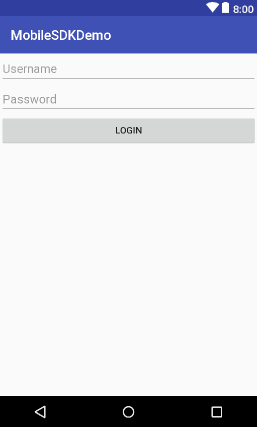

---
  topics:
  - title: Creating the Android project
    body: In this section you will learn how to create the Android project using Android Studio.
  - title: Using the $KANDY$ Mobile SDK in the Android project
    body: In this section you will learn how to use the $KANDY$ Mobile SDK in the Android project.
---
# Get Started

This section provides an example of creating your Android project and using the $KANDY$ Mobile SDK in your project. Android Studio 3.4.2 is used for this example, but you may use your development environment of choice to create your project.

## Base URL

This is the API Marketplace HTTPS entry point that you will use for authentication, REST services and WebSocket notifications.

```
$KANDYFQDN$
```

## ICE Servers

Use these primary and secondary URIs as the ICE Servers in the JavaScript, iOS or Android SDKs configuration when connecting and making calls. This is needed in order to ensure that calls can be established even the call peers are on different networks, behind firewalls. When the ICE server connects, it will try the Primary URL first. If that fails, it will try the Secondary URL.

#### Primary URL:

```
$KANDYICE1$
```

#### Secondary URL:

```
$KANDYICE2$
```

## Creating the Android project

The following procedure uses Android Studio IDE to illustrate adding the Mobile SDK library file to the Android application's build path.

1. Open the development environment (in this example, Android Studio).
2. Click **Start a new Android Studio project**.


<br>

3. Type your **Application name**, **Company domain**, and **Project location** and click **Next**.


<br>

4. Select minimum Android SDK version for phone and tablet (API Level 16 is recommended).

Note that, this is the minimum Android SDK API version that the demo application supports.

For the target SDK version, Google suggests to set API Level 26 or higher. Target SDK can be changed on **build.gradle** file after the project creation.


<br>

5. Select an activity or leave as default (Empty Activity) and click **Next**.


<br>

6. Edit the activity or leave as default and click **Finish**.


### Adding MobileSDK dependency to your project

There are 2 option to add MobileSDK dependency to your project. You can add MobileSDK dependency from github repository or you can add it your project manually. This document will explain both options in detail. 


#### Adding MobileSDK dependency to your project from GitHub repository
1. Add MobileSDK repository url to your root level **build.gradle** file. 


	```
	allprojects {
    	repositories {
        	google()
        	jcenter()

        	maven {
         	  url "https://raw.githubusercontent.com/Kandy-IO/kandy-cpaas-android-sdk/master/dist/"
        	}
   		}
	}
	```
	


2. Add dependcy of MobileSDK to your app level **build.gradle** file.

	```
	implementation 'com.kandy.mobile:kandycpaasmobilesdk:{version}'

	```

	

	---
	**NOTE**

	Check latest version of MobileSDK from [GitHub](https://github.com/Kandy-IO/kandy-cpaas-android-sdk). 

	---


#### Adding MobileSDK dependency to your project manually


1. Download latest MobileSDK version from [GitHub](https://github.com/Kandy-IO/kandy-cpaas-android-sdk) and copy **aar** file to your project **lib** folder.

 


2. After that you need to inform gradle that your app will use manual aar files. To do that add **flatDir** path to your root level **build.gradle** file as in the example above.

	```
	flatDir {
       dirs 'libs'
   }
	```
 

3. Add dependcy of MobileSDK to your app level **build.gradle** file with **@aar** prefix.

	```
	implementation 'com.kandy.mobile:kandycpaasmobilesdk:{version}@aar'

	```

	


### Adding Java 8 support
 An Android application project must be compatible with Java 8 when it is using Mobile SDK library. This necessity comes from the WebRTC library, its code is dependent on some Java 8 features. In order to set this compliance, open **build.gradle** file, located under **app** module of **MobileSDKDemoApp** project. Add the configuration script below to the file.

	```	
	android{
		compileOptions {
        targetCompatibility 1.8
        sourceCompatibility 1.8
    }
	}
	```
	


## Using the $KANDY$ Mobile SDK in the Android project

Once the library is attached to the Android project, the $KANDY$ Mobile SDK can be used by defining the necessary import items.
The following is an example using the $KANDY$ Mobile SDK in Android:

1. Locate and open **AndroidManifest.xml**.


2. Add the following permissions to the manifest file:

```xml
<uses-feature android:glEsVersion="0x00020000" android:required="true" />
<uses-feature android:name="android.hardware.camera" />
<uses-feature android:name="android.hardware.camera.autofocus" />

<uses-permission android:name="android.permission.INTERNET" />
<uses-permission android:name="android.permission.ACCESS_NETWORK_STATE" />
<uses-permission android:name="android.permission.MODIFY_AUDIO_SETTINGS" />
<uses-permission android:name="android.permission.RECORD_AUDIO" />
<uses-permission android:name="android.permission.CAMERA" />
```

<br>

3. In your project folder, navigate to **res** > **layout** and open **activity_main.xml** to create your UI.


<br>

4. You can create your UI in a graphical mode (if available) or in xml editor mode. In this example, editing will be done in the xml view.

5. Choose a layout for your UI. In Android, developers can use a variety of layouts for UI. In this example, we will use LinearLayout (Vertical) for the UI and set the orientation vertical. The example layout below also contains two buttons and two video views in the LinearLayout.

```xml
<?xml version="1.0" encoding="utf-8"?>

<LinearLayout xmlns:android="http://schemas.android.com/apk/res/android"
    xmlns:app="http://schemas.android.com/apk/res-auto"
    xmlns:tools="http://schemas.android.com/tools"
    android:layout_width="match_parent"
    android:layout_height="match_parent"
    android:gravity="center_horizontal"
    android:orientation="vertical"
    tools:context=".MainActivity">

    <EditText
        android:id="@+id/username"
        android:layout_width="match_parent"
        android:layout_height="wrap_content"
        android:hint="Username"
        android:maxLines="1"
        android:singleLine="true" />

    <EditText
        android:id="@+id/password"
        android:layout_width="match_parent"
        android:layout_height="wrap_content"
        android:hint="Password"
        android:maxLines="1"
        android:singleLine="true" />

    <Button
        android:id="@+id/login_button"
        android:layout_width="match_parent"
        android:layout_height="wrap_content"
        android:text="Login" />

</LinearLayout>
```


<br>
6. Create a custom application class, which extends the generic "Application" structure of Android. Application should set its application context to Mobile SDK when it is created.

```java
package com.rbbn.mobilesdkdemo;

import android.app.Application;
import android.content.Context;
import com.rbbn.cpaas.mobile.utilities.Globals;

public class DemoApplication extends Application {

    public void onCreate() {
        super.onCreate();

        Context context = getApplicationContext();
        Globals.setApplicationContext(context);
    }
}
```

<br>
7. Open the MainActivity. If project has no activity, create one.

```java
package com.rbbn.mobilesdkdemo;

import android.app.Activity;
import android.os.Bundle;

public class MainActivity extends Activity {

    @Override
    protected void onCreate(Bundle savedInstanceState) {
        super.onCreate(savedInstanceState);
        setContentView(R.layout.activity_main);
    }
}
```

<br>
8. Set $KANDY$ configurations for connection.

```java
Configuration.getInstance().setUseSecureConnection(useSecureConnection);
Configuration.getInstance().setRestServerUrl(restServerUrl);
Configuration.getInstance().setRestServerPort(restServerPort);
}
```

<br>
9. Create a method that gets *"Access Token"* from $KANDY$. Getting access token is explained in *"Getting Access Token from $KANDY$"* section in detail.

```java
public String getAccessToken(String username, String password) {
    //get Access token from $KANDY$
}
```

<br>
10. Add the following code to login action for establishing connection to $KANDY$.

```java
Button loginButton = (Button) findViewById(R.id.login_button);
loginButton.setOnClickListener(new View.OnClickListener() {
    @Override
    public void onClick(View v) {
      EditText usernameField = findViewById(R.id.username);
      String username = usernameField.getText().toString();

      EditText passwordField = findViewById(R.id.password);
      String password = passwordField.getText().toString();

      String accessToken = getAccessToken(username, password);

      int lifetime = 3600; //in seconds

      List<ServiceInfo> services = new ArrayList<>();
      services.add(new ServiceInfo(ServiceType.SMS, true));
      services.add(new ServiceInfo(ServiceType.CALL, true));

      CPaaS cpaas = new CPaaS(services);

      cpaas.getAuthentication().connect(username, accessToken, lifetime, new ConnectionCallback() {
                @Override
                public void onSuccess(String channelInfo) {
                    // connection is successful
                }

                @Override
                public void onFail(MobileError error) {
                    // connection failed
                }
      });
    }
});
```
